# AtomicArch

AtomicArch is a modern iOS application that demonstrates clean architecture principles and best practices in Swift development. The project showcases a well-structured, modular approach to building iOS applications with a focus on maintainability, testability, and scalability.

## 🔗 High-Level Design

- High-Level Design (HLD): [docs/HIGH_LEVEL_DESIGN.md](docs/HIGH_LEVEL_DESIGN.md)

## ✨ Project Goal

The primary goal of **AtomicArch** is to serve as a reference implementation of Clean Architecture in a modern iOS application. It is designed to be a practical guide for developers looking to build scalable, maintainable, and testable apps using **Swift**, **Combine**, and modern concurrency.

## 🏗 Architecture

The project follows **Clean Architecture principles** with a clear separation of concerns across four distinct layers:

### Core Layers

1. **Presentation Layer** (`Features/`)
   - UIKit-based views and view controllers
   - ViewModels for state management using Combine
   - Coordinators for navigation flow management
   - Builders for dependency injection and view creation

2. **Domain Layer** (`Domain/`)
   - Use case protocols and implementations
   - Domain entities (pure business models)
   - Repository interfaces
   - Domain errors and validation

3. **Data Layer** (`Data/`)
   - Repository implementations
   - Data models (API response models)
   - API endpoints and network configuration
   - Data transformation logic

4. **Infrastructure Layer**
   - `Networking/`: HTTP client and network utilities
   - `AtomicLogger/`: Logging system
   - `AtomicCore/`: Core utilities, protocols, and extensions

### Key Components

```mermaid
classDiagram
    direction TB

    %% Presentation Layer - ViewModels
    class ListUserGitHubViewModel {
        -viewState: ViewState
        -users: [UserEntity]
        -userUseCase: UserUseCase
        +transform(input: Input) Output
        +loadUsers(since: Int) async
        +loadMoreIfNeeded(for: UserEntity)
    }
    class UserDetailViewModel {
        -viewState: ViewState
        -user: UserDetailEntity?
        -userUseCase: UserUseCase
        -username: String
        +transform(input: Input) Output
        +loadUser() async
    }

    %% Presentation Layer - ViewControllers
    class ListUserGitHubViewController {
        -viewModel: ListUserGitHubViewModel
        +delegate: ListUserGitHubViewControllerDelegate?
    }
    class UserDetailViewController {
        -viewModel: UserDetailViewModel
        +delegate: UserDetailViewControllerDelegate?
    }

    %% Presentation Layer - Coordinators
    class ListUserGitHubCoordinator {
        -children: [Coordinator]
        -router: Router
        -userUseCase: UserUseCase
        -delegate: ListUserGitHubCoordinatorDelegate?
        +present(animated: Bool, onDismissed: (() -> Void)?)
        +didSelectUser(user: UserEntity)
    }
    class UserDetailCoordinator {
        -children: [Coordinator]
        -router: Router
        -user: UserEntity
        -userUseCase: UserUseCase
        -delegate: UserDetailCoordinatorDelegate?
        +present(animated: Bool, onDismissed: (() -> Void)?)
        +userDetailViewControllerDidFinish(_: UserDetailViewController)
    }

    %% Domain Layer - Protocols and Entities
    class UserUseCase {
        <<protocol>>
        +getListUser(perPage: Int, since: Int) async throws [UserEntity]
        +getUser(with loginUsername: String) async throws UserDetailEntity
    }
    class UserRepository {
        <<protocol>>
        +getListUser(perPage: Int, since: Int) async throws [UserEntity]
        +getUser(with loginUsername: String) async throws UserDetailEntity
    }
    class UserEntity {
        -id: UUID
        -login: String
        -avatarUrl: String
        -htmlUrl: String
    }
    class UserDetailEntity {
        -id: Int
        -login: String
        -name: String
        -company: String
        -blog: String
        -location: String
        -email: String
        -bio: String
        -publicRepos: Int
        -publicGists: Int
        -followers: Int
        -following: Int
    }

    %% Data Layer - Implementations
    class UserUseCaseImpl {
        -repository: UserRepository
        +getListUser(perPage: Int, since: Int) async throws [UserEntity]
        +getUser(with loginUsername: String) async throws UserDetailEntity
    }
    class UserRepositoryImpl {
        -networkService: NetworkService
        +getListUser(perPage: Int, since: Int) async throws [UserEntity]
        +getUser(with loginUsername: String) async throws UserDetailEntity
    }

    %% Data Layer - Models and Endpoints
    class UserResponse {
        -id: Int
        -login: String?
        -avatarUrl: String?
        -htmlUrl: String?
        +toDomain() UserEntity
    }
    class UserDetailResponse {
        -id: Int
        -login: String?
        -name: String?
        -company: String?
        -blog: String?
        -location: String?
        -email: String?
        -bio: String?
        -publicRepos: Int?
        -publicGists: Int?
        -followers: Int?
        -following: Int?
        +toDomain() UserDetailEntity
    }
    class UserEndpoint {
        +getListUser(Int, Int)
        +getUserDetail(String)
    }

    %% Infrastructure Layer
    class NetworkService {
        <<protocol>>
        +request<T: Decodable>(_ target: Target) async throws T
    }
    class Target {
        <<protocol>>
        +path: String
        +method: HTTPMethod
        +task: Task
        +headers: [String: String]
    }
    class NetworkError {
        <<enum>>
        +noConnection
        +invalidResponse
        +serverError
        +decodingError
        +unknown
    }

    %% Relationships
    ListUserGitHubViewController ..> ListUserGitHubViewModel : uses
    UserDetailViewController ..> UserDetailViewModel : uses

    ListUserGitHubViewModel ..> UserUseCase : uses
    UserDetailViewModel ..> UserUseCase : uses

    UserUseCaseImpl ..|> UserUseCase : implements
    UserUseCaseImpl --> UserRepository : uses

    UserRepositoryImpl ..|> UserRepository : implements
    UserRepositoryImpl --> NetworkService : uses

    UserRepositoryImpl --> UserEndpoint : uses
    UserRepositoryImpl --> UserResponse : transforms
    UserRepositoryImpl --> UserDetailResponse : transforms

    UserResponse --> UserEntity : toDomain()
    UserDetailResponse --> UserDetailEntity : toDomain()

    NetworkService ..> Target : defines request target
    NetworkService ..> NetworkError : throws

    ListUserGitHubCoordinator ..|> Coordinator : implements
    ListUserGitHubCoordinator --> Router : uses
    ListUserGitHubCoordinator --> UserUseCase : uses
    ListUserGitHubCoordinator --> ListUserGitHubViewController : presents
    ListUserGitHubCoordinator --o UserDetailCoordinator : presents child
    ListUserGitHubCoordinator ..> ListUserGitHubCoordinatorDelegate : delegates to

    UserDetailCoordinator ..|> Coordinator : implements
    UserDetailCoordinator --> Router : uses
    UserDetailCoordinator --> UserUseCase : uses
    UserDetailCoordinator --> UserDetailViewController : presents
    UserDetailCoordinator ..> UserDetailCoordinatorDelegate : delegates to

    Coordinator o-- Coordinator : manages children
```



## 🚀 Features

### User Management
- **User List**: Display GitHub users with infinite scroll pagination
- **User Details**: View comprehensive user profiles with detailed information
- **Asynchronous Loading**: Efficient image loading and data fetching
- **Error Handling**: Comprehensive error states with retry mechanisms
- **State Management**: Reactive UI updates using Combine framework

### Technical Features
- **Clean Architecture**: Strict separation of concerns across layers
- **Protocol-Oriented Design**: Dependency inversion through protocols
- **Async/Await**: Modern concurrency patterns throughout the app
- **Combine Integration**: Reactive programming for state management
- **Dependency Injection**: Builder pattern for clean dependency management
- **Coordinator Pattern**: Clean navigation flow management
- **Unit Testing**: Comprehensive test coverage with mocking

## 📦 Project Structure

```
AtomicArch/
├── Application/            # App lifecycle and configuration
│   ├── AppDelegate.swift
│   ├── SceneDelegate.swift
│   ├── AppConfig.swift
│   └── Environment.swift
├── Features/               # Feature modules (Presentation layer)
│   └── Users/
│       ├── List/
│       ├── Detail/
│       └── Builders/
├── Domain/                 # Business logic (Domain layer)
│   ├── Entities/
│   ├── Interfaces/
│   │   └── Repositories/
│   └── UseCase/
│       └── Protocol/
├── Data/                   # Data layer implementation
│   ├── Models/
│   ├── Repository/
│   └── Network/
│       ├── Endpoint/
│       └── Interceptor/
├── Router/                 # Navigation infrastructure
├── Networking/             # Networking module (Swift Package)
├── AtomicLogger/           # Logging module (Swift Package)
├── AtomicCore/             # Core utilities (Swift Package)
└── AtomicArchTests/        # Test suite
    ├── Unit/
    │   ├── ViewModel/
    │   ├── UseCase/
    │   └── Repository/
    ├── Helpers/
    └── Mocks/
```

## 🛠 Technical Stack

- **Language**: Swift 5.9+
- **UI Framework**: UIKit with programmatic UI
- **Architecture**: Clean Architecture with MVVM
- **State Management**: Combine framework
- **Networking**: URLSession with async/await
- **Dependency Injection**: Builder pattern
- **Navigation**: Coordinator pattern
- **Testing**: XCTest with comprehensive mocking
- **Dependency Management**: Swift Package Manager
- **Code Quality**: SwiftLint, SwiftFormat

## 🧪 Testing Strategy

The project implements a comprehensive testing strategy focused on business logic and user interactions:

### 1. Unit Tests
- **ViewModel Tests**: State management, user interactions, error handling, and pagination logic
- **Use Case Tests**: Business logic validation and data transformation
- **Repository Tests**: Data layer integration and error handling

### 2. Test Organization
```
AtomicArchTests/
├── Unit/
│   ├── ViewModel/
│   │   ├── ListUserGitHubViewModelTests.swift
│   │   └── UserDetailViewModelTests.swift
│   ├── UseCase/
│   │   └── UserUseCaseImplTests.swift
│   └── Repository/
│       └── UserRepositoryImplTests.swift
├── Helpers/
│   ├── TestData.swift
│   └── XCTest+Async.swift
└── Mocks/
    ├── UserUseCaseMock.swift
    └── UserRepositoryMock.swift
```

A test plan is provided: `AtomicBTestPlan.xctestplan`.

### 3. Testing Principles
- **Isolation**: Each test is independent with proper mocking
- **Coverage**: Focus on business logic and user interactions
- **Maintainability**: Clear test structure with descriptive names
- **Performance**: Fast execution with minimal dependencies

<!-- Removed duplicate test commands (see Development Setup > Running Tests) -->

## 🔄 CI/CD Pipeline

The project uses GitHub Actions for continuous integration:

1. **Pre-commit Hooks**
    - Code formatting (SwiftFormat)
    - Linting (SwiftLint)

2. **Pull Request Checks**
    - Lint (SwiftLint using .swiftlint.yaml)
    - Build and run tests on macOS runner

3. **Main Branch CI**
    - On push to main, build and run tests

4. **Release**
    - Pushing a tag matching v*.*.* triggers a release
    - Release notes are generated from a template (.github/release-template.md) and changelog

## 📚 Documentation

- **High-Level Design (HLD)**: See docs/HIGH_LEVEL_DESIGN.md for the full system design and module interactions
- **Architecture Documentation**: This README provides comprehensive architecture overview
- **API Documentation**: Inline documentation for all public APIs
- **Testing Guidelines**: Clear testing patterns and best practices
- **Contribution Guidelines**: Development workflow and standards

## 🔧 Development Setup

1. **Prerequisites**
   - Xcode 15.0+
   - Swift 5.9+
   - iOS 18.5+ Simulator

2. **Installation**
   ```bash
   git clone https://github.com/phanquangcong/AtomicArch.git
   cd AtomicArch
   xcodebuild -resolvePackageDependencies -project AtomicArch.xcodeproj
   ```

3. **Running the App**
   ```bash
   xcodebuild -scheme AtomicArch -destination 'platform=iOS Simulator,name=iPhone 16 Pro,OS=latest' build
   ```
   Or open the project in Xcode, choose the **AtomicArch** scheme and an iOS 18.5+ simulator, then Run (⌘R).

4. **Running Tests**
   ```bash
   ruby Scripts/run-tests.rb
   ```
   The script picks an available simulator (booted first, else first iPhone). Or run directly:
   ```bash
   xcodebuild test -scheme AtomicArch -destination 'platform=iOS Simulator,name=iPhone 16 Pro,OS=latest'
   ```
   In Xcode you can use the test plan `AtomicBTestPlan.xctestplan` or run tests with ⌘U.

## 🧹 Linting & Formatting

- SwiftFormat and SwiftLint are configured for consistent style and quality.
- Pre-commit is set up to run these tools automatically.

Setup locally:

1. Install tools (once): SwiftFormat, SwiftLint, and pre-commit
2. Install the hooks: pre-commit install
3. Run on all files (optional): pre-commit run --all-files

Configs:

- SwiftLint: .swiftlint.yaml
- SwiftFormat: .swiftformat (with Swift version in .swift-version)

### Development Guidelines
- Follow Clean Architecture principles
- Write comprehensive unit tests
- Maintain code documentation
- Use SwiftLint and SwiftFormat
- Follow the established naming conventions

## 🤝 Contributing

We welcome contributions! Please follow these steps to get your environment ready and keep changes consistent with the project’s standards.

### 1) Set up local tooling (one time)

Install the code quality tools and Git hooks helper:

```bash
# macOS via Homebrew
brew install pre-commit swiftlint swiftformat

# Alternatively (for pre-commit)
pipx install pre-commit  # or: pip install --user pre-commit
```

### 2) Enable pre-commit hooks

```bash
pre-commit install

# Optional: run on the full repo once
pre-commit run --all-files
```

Pre-commit will automatically format with SwiftFormat and lint with SwiftLint on each commit.

### 3) Run local quality checks

```bash
# Format
swiftformat .

# Lint
swiftlint lint --config .swiftlint.yaml

# Tests (uses first available simulator)
ruby Scripts/run-tests.rb
```

### 4) Create a PR

- Keep changes focused and include tests where applicable
- Ensure pre-commit, lint, and tests pass locally
- Open a PR to `main`; CI will run PR checks (lint + build/test)

## 🎥 Demo

<div align="center">
    
</div>

## 📄 License

This project is licensed under the MIT License — see the [LICENSE](LICENSE) file for details.
